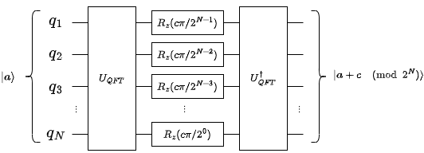

# Register-by-Constant QFT Addition Algorithm - by Filipe Chagas Ferraz

[](https://zenodo.org/badge/latestdoi/525301217)

## Introduction

This is a quantum algorithm I created that can be considered a simplified version of Draper's adder. This algorithm is described as a unitary operator $U_+(c)$ such that $U_+(c)|a\rangle = | a + c \pmod{2^N}\rangle$, where $|a\rangle$ is the initial state of the $N$-qubit register. This state can be defined for natural number as:

$$|a\rangle = |a_N,...,a_2,a_1\rangle, \quad a = \sum_{j=1}^N a_j 2^{j-1}$$

This state can also be defined for (signed) integer numbers using the two's complement notation.

The operator $U_+(c)$ is defined as $U_+(c) = U_\text{QFT}^\dagger \times U_{\phi(+)}(c) \times U_\text{QFT}$, where $U_{\phi(+)}(c) = \text{diag}[1, \omega^{c}, \omega^{2c}, \omega^{3c},...,\omega^{(2^N-1)c}]$. This operator can be implemented as the following quantum circuit:



## Organization

This repository is organized as follows:

* The file **qiskit_quantum_fourier_transform.py** contains a function that gives the QFT gate. As the filename says, this function uses Qiskit.
* The file **qiskit_reg_by_const_qft_adder.py** has functions that gives Qiskit gates of the operators $U_+(c)$ and $U_{\phi(+)}(c)$.
* The file **qiskit_reg_by_const_qft_adder_test.ipynb** is a Jupyter notebook made for test the functions in *qiskit_reg_by_const_qft_adder.py*. This notebook contains the results of some tests.

* The file **numeric_systems.py** has functions that convert natural numbers and integers into sequences of bits. These functions are used for testing.

* The file **test_tools.py** contains functions that are used for testing.

## Paper

This algorithm is described in detail in the paper *"Quantum Algorithm based on Quantum Fourier Transform for Register-by-Constant Addition"* (https://doi.org/10.48550/arXiv.2207.05309). If you use this algorithm in your research, please cite it as follows:

```
@misc{ferraz_22,
  doi = {10.48550/ARXIV.2207.05309},
  url = {https://arxiv.org/abs/2207.05309},
  author = {Ferraz, Filipe Chagas},
  keywords = {Quantum Physics (quant-ph), FOS: Physical sciences, FOS: Physical sciences},
  title = {Quantum Algorithm based on Quantum Fourier Transform for Register-by-Constant Addition},
  publisher = {arXiv},
  year = {2022},
  copyright = {Creative Commons Attribution 4.0 International}
}
```
